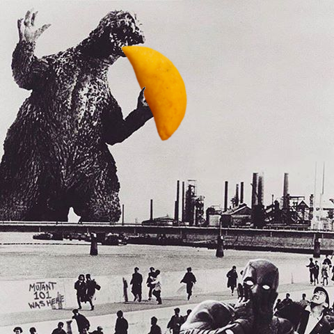

<head>
  <meta charset="utf-8">
  <title>Juan C. Arboleda R. - Personal</title>
  <link rel="stylesheet" href="styles/main.css">
  <link rel="shortcut icon" href="images/nea-onnim-g.svg">
  <meta name="viewport" content="width=device-width, initial-scale=1.0">
</head>

# Personal information

Some of my hobbies are swimming, playing guitar, reading and learning
both human and programming languages.
I am a big fan of Godzilla too!

<figure>
  
  <figcaption><small>Godzilla eating a giant empanada.</small></figcaption>
</figure>

## Favorite books

- The Pleasure of Finding Things Out: The Best Short Works of Richard P. Feynman.
- Surely You're Joking Mr Feynman: Adventures of a Curious Character as Told to Ralph Leighton.
- Twenty Thousand Leagues Under the Sea. _Jules Verne_.
- The Hitchhiker's Guide to the Galaxy. _Douglas Adams_.
- The Silmarillion. _J.R.R. Tolkien_.
- The Future of the Mind: The Scientific Quest to Understand, Enhance, and Empower the Mind. _Michio Kaku_.
- La mamá de Kepler. _Sergio de Régules_.
- Roots: The Saga of an American Family. _Alex Haley_.
- The Panda's Thumb: More Reflections in Natural History. _Stephen Jay Gould_.
- Alice's Adventures in Wonderland. _Lewis Carroll_.
- Ideas. _Peter Watson_.

  <address class="mail">
    Contact me: <a href="mailto:juan.arboleda2@udea.edu.co">juan.arboleda2@udea.edu.co</a>
  </address>

